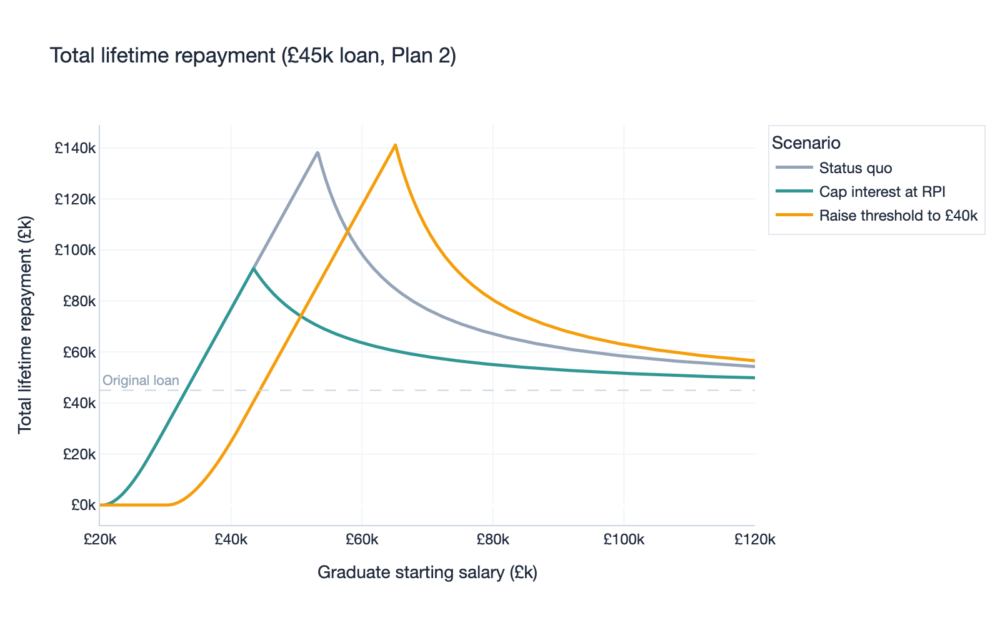
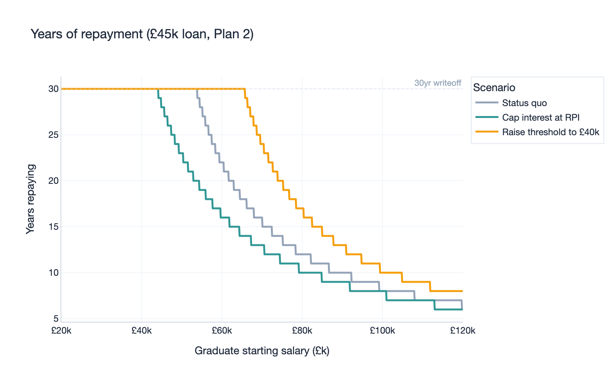
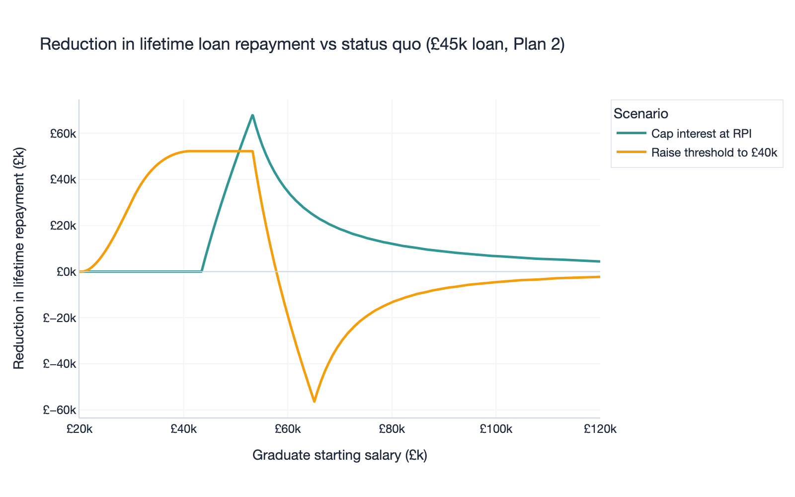
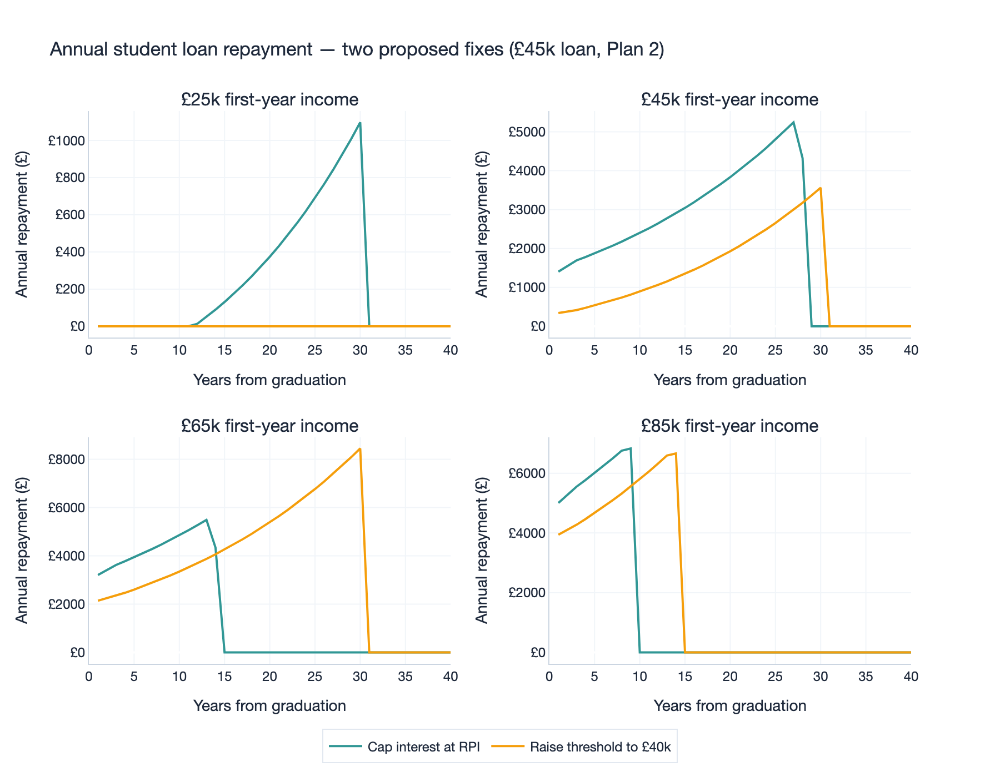

# Two Fixes for Plan 2: Cap Interest vs Raise Threshold

## Introduction

Plan 2 student loans affect everyone who started university in England between 2012 and 2022. Graduates [repay](https://www.gov.uk/repaying-your-student-loan/what-you-pay) 9% of everything they earn above £29,385 for up to 30 years. Interest accrues at RPI plus up to 3% depending on income.

In February 2026, Martin Lewis and Kemi Badenoch [clashed](https://www.theguardian.com/money/2025/feb/20/why-the-student-loans-row-is-escalating-and-what-it-means-for-graduates) on Good Morning Britain over how to fix this.

This analysis simulates both proposed fixes against the current system to quantify who repays less under each, and by how much.

## The two proposals

### Cap interest at RPI

Badenoch proposes removing the RPI+3% sliding scale. Her fix: **cap Plan 2 interest at RPI only**, removing the +3% top-up entirely.

This does not change what borrowers repay each month. The annual repayment remains 9% above £29,385 regardless of the interest rate. What changes is how fast the balance shrinks. Lower interest means more of each payment goes to principal, so higher earners clear the loan years earlier.

### Raise threshold to £40k

Lewis proposes raising the repayment threshold. His fix: **raise the repayment threshold to £40,000 and index it to RPI from day one**.

This directly reduces what borrowers repay each month. Anyone earning under £40k stops repaying entirely. Those just above £40k repay far less per year. The interest rate stays the same, so balance growth is unaffected, but lower annual payments mean more of the loan is written off at the end.

## Who repays less under each fix?

Both fixes are simulated alongside the current system for a £45,000 Plan 2 loan, assuming 3.5% annual salary growth and Office for Budget Responsibility inflation forecasts. The following four charts examine who repays less, how quickly they clear their debt, and how the two fixes distribute their benefits across the income range.

### 1. Total lifetime repayment by starting salary

This chart shows the total amount repaid to the Student Loans Company over the life of the loan. The current system (grey) peaks around £50k starting salary. These mid-earners repay the most because they earn enough to make large payments but not enough to clear the balance before interest compounds. Capping interest (teal) brings the peak down substantially. Raising the threshold (amber) shifts the entire curve to the right, eliminating repayments for everyone under £40k.

### 2. Years of repayment by starting salary

This chart shows the number of years spent repaying under each scenario. Under the current system, everyone below roughly £50k starting salary repays for the full 30 years before their loan is written off. Capping interest shortens this period. A graduate starting on £45k clears their loan around year 22 instead of year 30. Raising the threshold pushes more people towards the 30-year writeoff ceiling, because lower annual payments mean the balance is never fully cleared.

### 3. Reduction in lifetime repayment vs current system

This chart shows the reduction in total lifetime repayment under each fix compared to the current system. This is not a measure of welfare gain. The written-off balance is absorbed by the taxpayer, not forgiven. Capping interest (teal) peaks at roughly £67k less repaid for graduates starting around £50k. Raising the threshold (amber) peaks at roughly £55k less repaid for graduates starting around £30–35k, but goes negative for those starting between £55–75k. These earners repay more under this fix, because lower annual payments allow interest to compound for longer before writeoff.

### 4. Annual repayment over time (4 income levels)

This chart shows year-by-year repayment for four first-year incomes under the two proposed fixes. The current system is omitted for clarity, as it overlaps with the cap interest line on annual repayment (both use the same £29,385 threshold).

Each subplot corresponds to one first-year income level:

- **£25k first-year income**: Capping interest produces rising repayments that are written off at year 30. Raising the threshold results in zero repayment throughout, as earnings never reach £40k early enough.
- **£45k first-year income**: Capping interest clears the loan around year 22, at which point repayment drops to zero. Raising the threshold produces lower annual payments but repayment continues until the 30-year writeoff.
- **£65k first-year income**: Capping interest clears the loan around year 15. Raising the threshold means repayment continues until roughly year 27.
- **£85k first-year income**: Capping interest clears the loan around year 11. Raising the threshold clears it around year 27. Both eventually pay off, but capping interest results in the loan clearing 16 years sooner.
