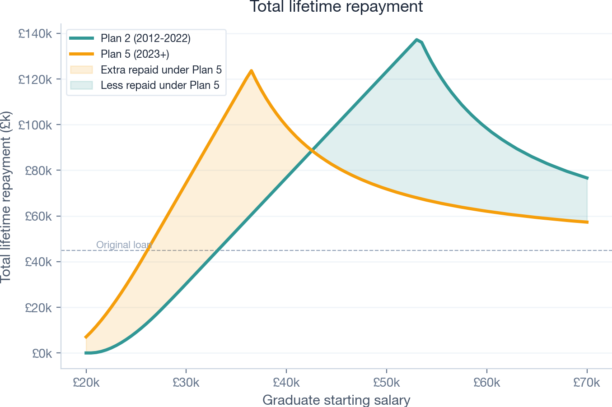
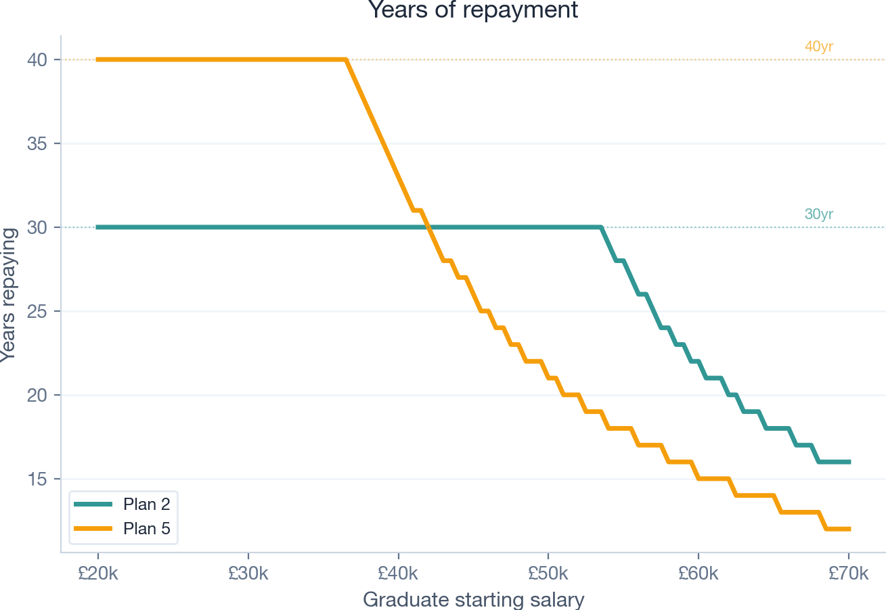
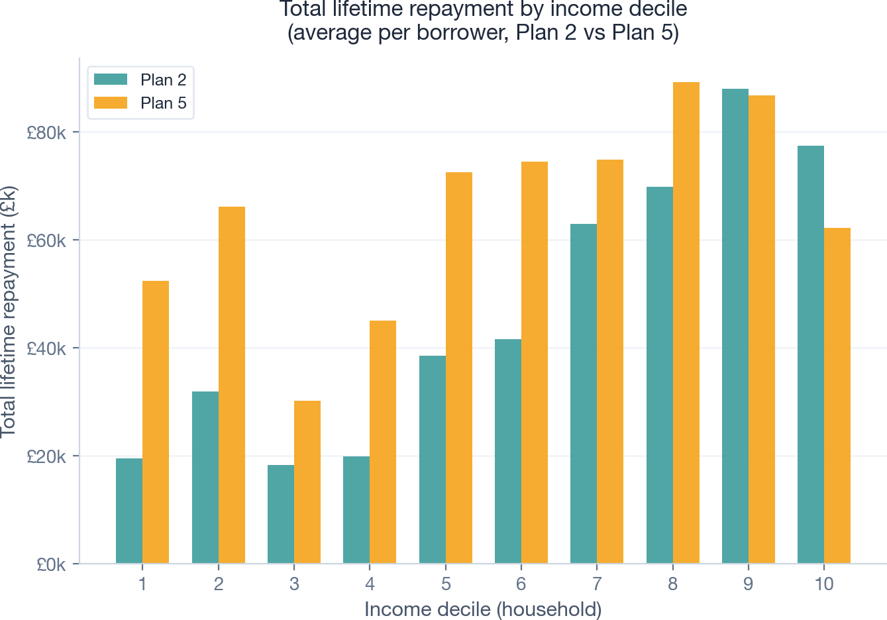

# Plan 2 vs Plan 5: Who Pays More Under the 2023 Student Loan Reform?

The 2023 reform replaced **Plan 2** with **Plan 5** for new university students in England. Following the [public clash between Martin Lewis and Kemi Badenoch](https://www.theguardian.com/money/2025/feb/20/why-the-student-loans-row-is-escalating-and-what-it-means-for-graduates) over whether the new system is fairer, this analysis uses [PolicyEngine UK](https://policyengine.org/uk) microdata to quantify who actually pays more and who pays less.

## Background

| | Plan 2 (2012-2022 starters) | Plan 5 (2023+ starters) |
|---|---|---|
| **Repayment threshold** | ~£27,295 | £25,000 |
| **Interest rate** | RPI + up to 3% (sliding scale) | RPI only |
| **Write-off period** | 30 years | 40 years |
| **Repayment rate** | 9% above threshold | 9% above threshold |

The headline interest rate is lower under Plan 5, but the extra 10 years of repayment convert many middle earners from "written off" to "full repayers" -- substantially increasing their lifetime cost.

## Key findings

**Low and middle earners repay significantly more under Plan 5.** A median graduate (£30k starting salary) repays roughly £44k more over their lifetime. The lower threshold and 40-year term outweigh the lower interest rate.

**High earners repay less under Plan 5.** A £55k starter saves around £58k, because the RPI-only interest dramatically reduces the balance they accrue compared to Plan 2's RPI+3%.

**The crossover point is around £38-40k starting salary.** Below this, Plan 5 costs more. Above this, Plan 5 costs less.

## Charts

### Total lifetime repayment by starting salary


### Years of repayment by starting salary


### Total lifetime repayment by household income decile


### Typical graduate profiles


## How it works

The model (`policy_comparison.py`) does the following:

1. **Loads Plan 2 and Plan 5 parameters** from PolicyEngine UK (thresholds, interest rates, repayment rates)
2. **Simulates year-by-year loan repayment** for each plan, accounting for salary growth (3.5%/yr), OBR RPI forecasts, threshold indexation rules, and the Plan 2 interest sliding scale
3. **Sweeps across starting salaries** (£20k-£70k) to show how outcomes vary by earnings
4. **Uses PolicyEngine UK microdata** to distribute results across the actual income distribution, weighted by household income decile
5. **Generates four chart panels** as separate PNGs plus a combined overview

### Assumptions

- £45,000 loan balance
- 3.5% annual salary growth
- OBR RPI forecasts (2024-2029), then 2.39% long-term
- Plan 2 threshold frozen 2027-2029, RPI-indexed from 2030
- Plan 5 threshold RPI-indexed from 2027

## Running

```bash
pip install -r requirements.txt
python policy_comparison.py
```

Outputs:
- `policy_comparison.png` -- combined 4-panel chart
- `panel_salary.png`, `panel_years.png`, `panel_decile.png`, `panel_profiles.png` -- individual panels

## Media context

- [Martin Lewis clashes with Kemi Badenoch over student loan reforms (The Guardian)](https://www.theguardian.com/money/2025/feb/20/martin-lewis-apologises-to-kemi-badenoch-after-gate-crashing-interview)
- [Why the student loans row is escalating (The Guardian)](https://www.theguardian.com/money/2025/feb/20/why-the-student-loans-row-is-escalating-and-what-it-means-for-graduates)
- [Badenoch clashes with Martin Lewis over student loan reforms (Evening Standard)](https://www.standard.co.uk/news/politics/badenoch-clashes-martin-lewis-student-loan-reforms-b1212817.html)
- [Martin Lewis apologises after gatecrashing Badenoch interview (The Independent)](https://www.independent.co.uk/news/uk/politics/martin-lewis-kemi-badenoch-student-loans-b2702841.html)

## Built with

- [PolicyEngine UK](https://policyengine.org/uk) -- tax-benefit microsimulation model and microdata
- Python, NumPy, pandas, matplotlib
